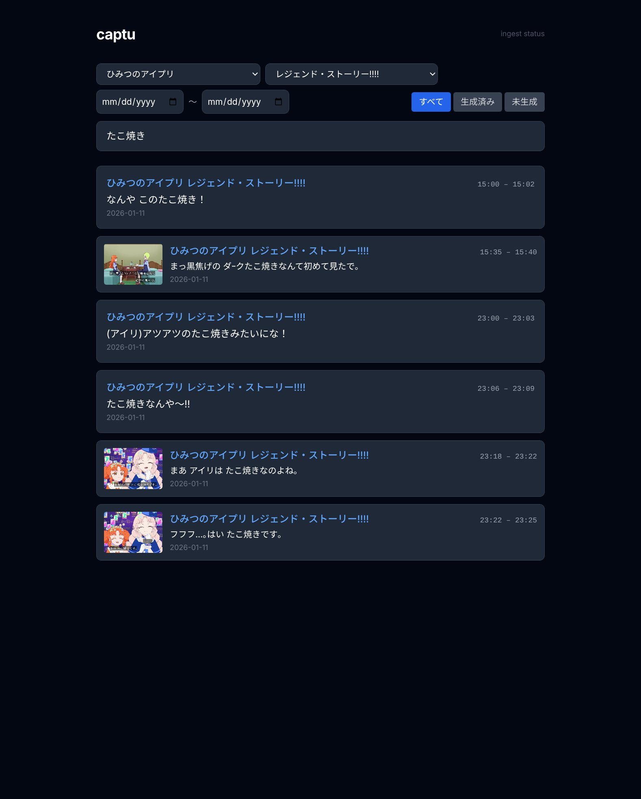
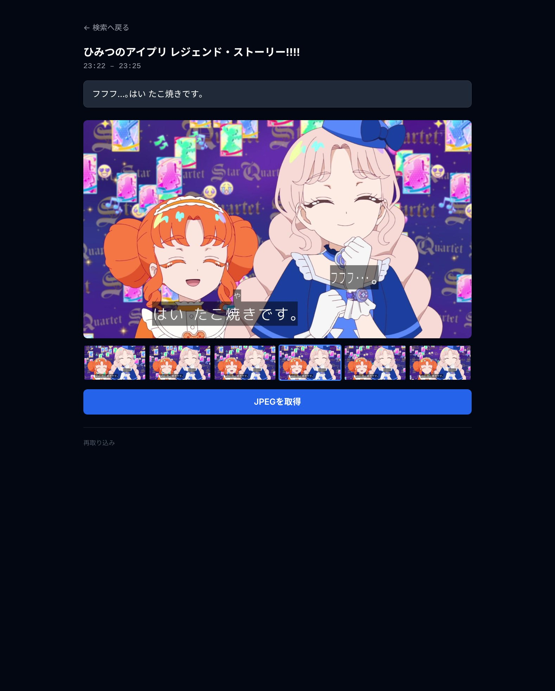

# captu

地デジ録画TSファイルから字幕テキストを抽出・索引化し、文言検索 → コンタクトシートでフレーム選定 → JPEG共有/コピーを行うWebアプリ。

 

## 機能 (実装済み)

- ARIB字幕の部分一致テキスト検索
- EPGメタデータ抽出 (タイトル・話数・放送日時)
- コンタクトシート表示 (字幕PNGオーバーレイ付き)
- 差分取り込み、並列取り込み、フィルタ (タイトル/話数/サブタイトル/日付)、再取り込み
- JPEG取得: スマホは Web Share API / PCはクリップボードコピー / その他はダウンロード

**未実装 (将来):** 定期スケジューラ、LLM AI検索、タグ付け

## ディレクトリ構成

```
captu/
├── src/
│   ├── main.rs        # axumサーバ
│   ├── config.rs      # 設定
│   ├── db.rs          # SQLiteスキーマ・接続プール
│   ├── ingest.rs      # TSスキャン・取り込みオーケストレーション
│   ├── ts/            # TSパース層
│   │   ├── b24.rs     # ARIB STD-B24テキストコーデック
│   │   ├── epg.rs     # EIT/EPGパーサ
│   │   ├── pes.rs     # ARIB字幕PESデマクサ
│   │   └── subtitle.rs # libaribcaption FFI字幕抽出・on-demand描画
│   ├── media/
│   │   └── capture.rs # ffmpeg 単一パスサムネ生成
│   ├── routes/        # axumルートハンドラ
│   └── bin/
│       ├── extract.rs    # 診断CLI: TSから字幕/EPGをダンプ
│       └── ingest_cli.rs # 本番CLI: スキャン・再取り込み
│
├── crates/
│   ├── aribcaption-sys/     # libaribcaption raw FFI bindings (bindgen)
│   │   └── vendor/libaribcaption/  # git submodule
│   └── aribcaption/         # safe Rust wrappers (Context/Decoder/Renderer)
│
├── ui/
│   ├── templates/     # askamaテンプレート (layouts/ / pages/ / fragments/)
│   └── static/        # app.js (コンタクトシート), search.js (検索フィルタ)
├── assets/fonts/      # ARIB字幕用 Rounded M+ フォント
├── docs/spec.md       # 設計仕様
├── CLAUDE.md          # 開発ガイド (モジュール構成・技術規約)
├── Dockerfile         # マルチターゲット (builder-base / builder / dev / runtime)
└── compose.yaml
```

## ビルド要件

```bash
# 1. submodule 初期化
git submodule update --init

# 2. 依存ツール (bindgen/cmake用)
#    Debian/Ubuntu: apt install cmake clang libclang-dev
#    → Docker経由なら不要 (Dockerfileに含む)
```

### Docker (推奨)

```bash
# 開発ビルド (root所有ファイル回避、NAS不要で基本動作確認可)
# 初回は Dockerfile の dev ターゲットを自動ビルドする
scripts/dev.sh build
scripts/dev.sh run --bin extract -- /mnt/nas/video/sample.ts

# NASマウントを使う場合
CAPTU_NAS_HOST=/mnt/your/recordings scripts/dev.sh run --bin ingest_cli -- --scan /mnt/nas/video

# 本番 (runtime ターゲット — stock ffmpeg + aribcaption-sys static link)
cp config.toml.example config.toml  # 編集して録画ディレクトリ等を設定
docker compose up --build -d
```

### config.toml

`config.toml.example` をコピーして編集。主要設定:

| キー | 説明 |
|---|---|
| `paths.nas_mount` | 録画ディレクトリのコンテナ内パス |
| `paths.ts_glob` | TSファイルの検索パターン |
| `capture.width/height` | サムネ解像度 (地上波: 1920×1080) |
| `capture.thumb_count` | コンタクトシートのサムネ枚数 |
| `ingest.concurrency` | 並列取り込みワーカー数 |

環境変数 `CAPTU_NAS_MOUNT / CAPTU_TS_GLOB / CAPTU_DB_PATH / CAPTU_CACHE_DIR` でも上書き可能。

## CLIの使い方

```bash
# TSから字幕/EPGを診断出力 (extract bin)
scripts/dev.sh run --bin extract -- /mnt/nas/video/example.ts
scripts/dev.sh run --bin extract -- /mnt/nas/video/example.ts --debug-raw

# 手動取り込み (ingest_cli bin)
scripts/dev.sh run --bin ingest_cli -- --scan /mnt/nas/video
scripts/dev.sh run --bin ingest_cli -- --reingest <ts_file_id>
scripts/dev.sh run --bin ingest_cli -- --reingest-program <program_id>
```

## キャッシュ構成

```
cache/{ts_stem}/
  captions.pes           # ARIB字幕PESブロブ (取り込み時に保存)
  sub/{caption_id}.png   # 字幕PNG (on-demand描画、初回アクセス時に生成)
  thumbs/
    {caption_id}_{n:02}.jpg  # コンタクトシートJPEG (コンタクトシート表示時に生成)
```

## ライセンス

| コンポーネント | ライセンス |
|---|---|
| 本体コード | MIT (`LICENSE`) |
| libaribcaption (submodule) | MIT (`crates/aribcaption-sys/vendor/libaribcaption/LICENSE`) |
| Rounded M+ 1m for ARIB (フォント) | 自家製 Rounded M+ ライセンス (`assets/fonts/Readme.txt`) |

フォント入手元: https://www.axfc.net/u/3107925
